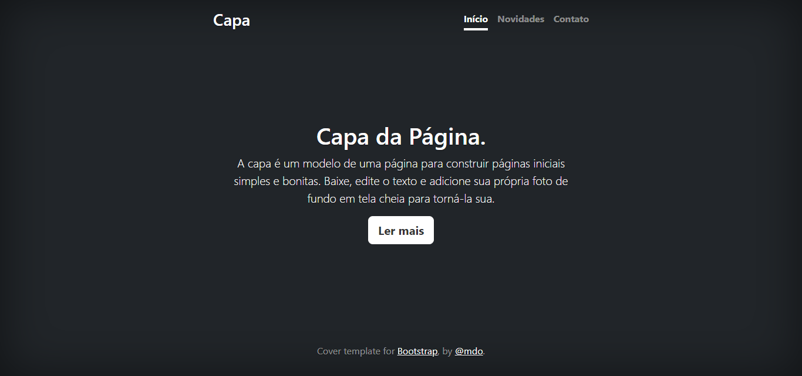

# Índice

[Projeto - Aprendendo a escrever um README](#projeto---aprendendo-a-escrever-um-readme)

[Descrição](#descri%C3%A7%C3%A3o)

[Introdução](#introdu%C3%A7%C3%A3o)

[Funcionalidades](#funcionalidades)

[Tecnologias utilizaveis](#tecnologias-utilizaveis)

[Fontes consultadas](#fontes-consultadas)

[Autores](#autores)

# Projeto - Aprendendo a escrever um README

## Descrição

## Introdução

## Funcionalidades

### Início

**Novidades**: Redireciona o usuário para a página de novidades, onde são colocados todas as atualizações do portfólio.

**Contatos**: Redireciona o usuário para a página que contém formas de se comunicar com o administrador da página.

**Ler mais**: Redireciona o usuário para a página onde o ira contar com um texto explicativo sobre a capa

**Bootstrap**: Redireciona o usuário para o site oficial do [bootstrap](https://getbootstrap.com/)

**@mdo**: Redireciona o usuário para a página no twitter do criador da página. [@mdo](https://twitter.com/mdo)

### Tecnologias utilizaveis

## Fontes consultadas 

## Autores

Danilo Felype Lima

Samuel Camargo de Farias

Leonardo Fernando Freire Gomes de Souza